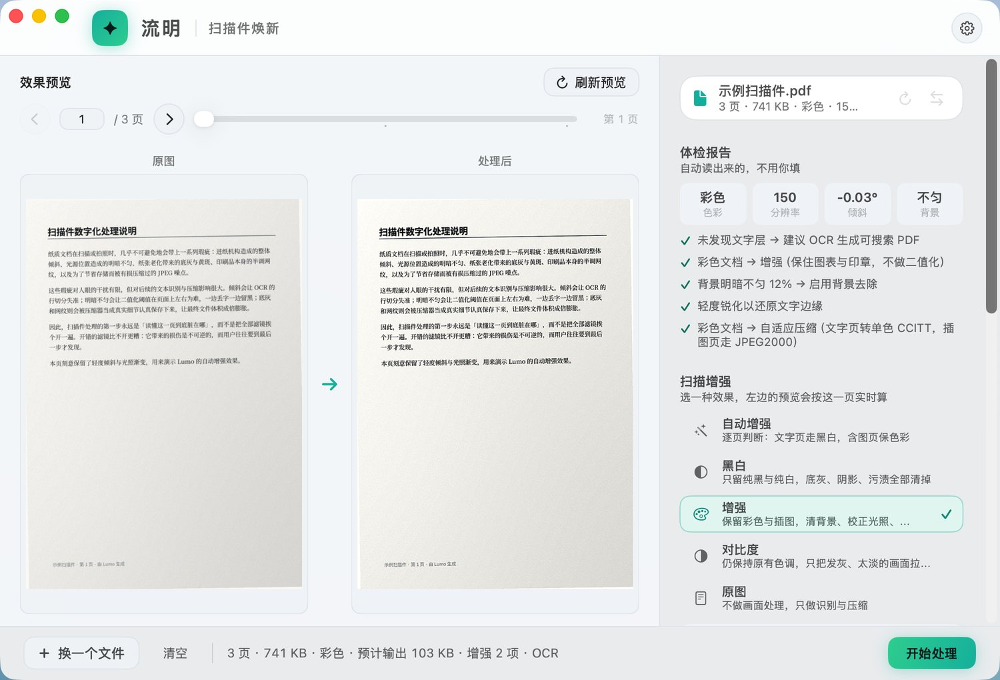
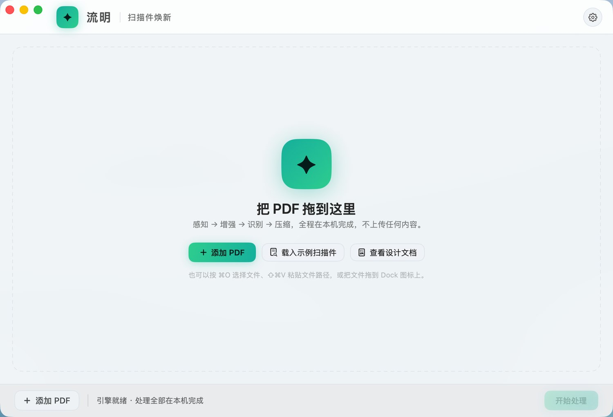
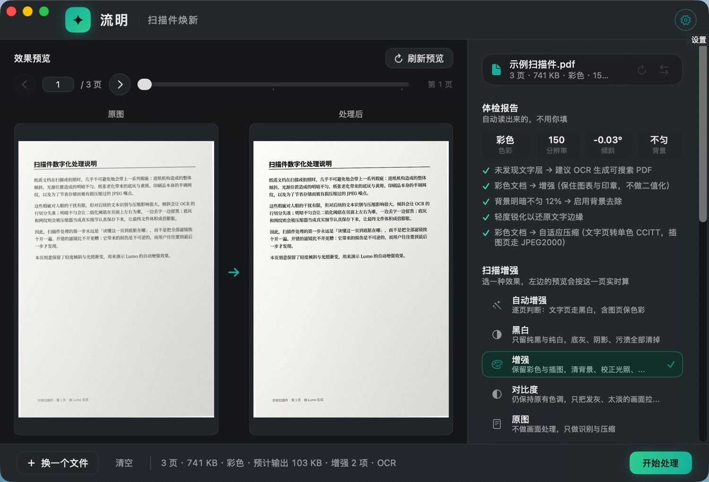
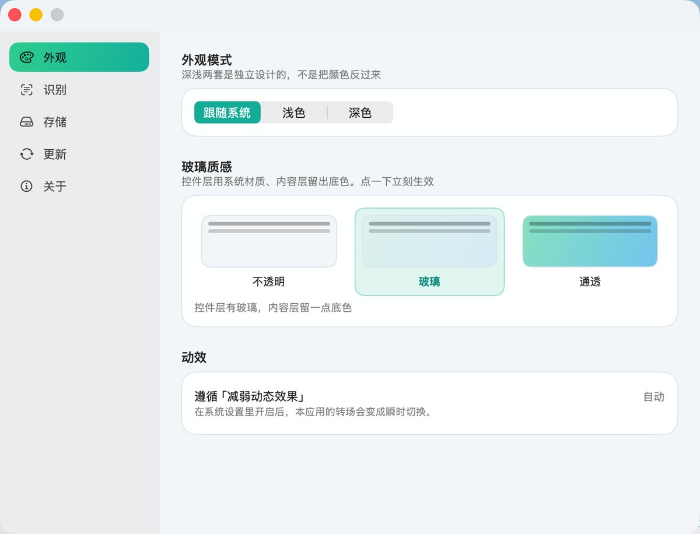
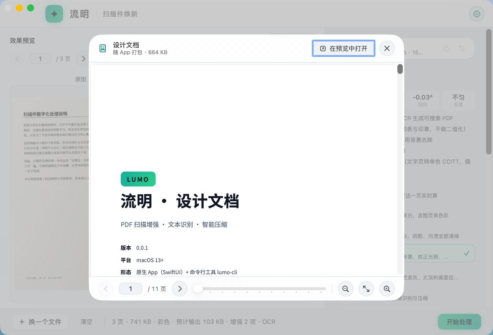

# Lumo · 流明

[](https://github.com/sdtafxy/lumo-macos/actions/workflows/ci.yml)
[](https://github.com/sdtafxy/lumo-macos/releases/latest)
[](LICENSE)


> 扫描件，一键焕新。

Lumo 是一个 macOS 原生 App：把一个又大又灰的扫描 PDF 拖进来，得到一份**看着干净、文字可搜、体积小得多**的 PDF。全程在本机完成，不上传任何内容。

**零第三方依赖。** 算法核心是本仓库的 `LumoCore`，只链接系统框架（CoreGraphics / Core Image / Vision / ImageIO / PDFKit / zlib）。没有 Python、没有 Homebrew、没有 Tesseract、没有 venv——下载 DMG、拖进「应用程序」、打开即用。



---

## 它解决的问题

用通用 PDF 工具处理扫描件，要在「扫描增强 → 文本识别 → 压缩」三个面板之间来回切换、逐项调参，调完不满意再重来一遍。**而这个过程里用户做的决定，大部分机器本来就能做对。**

Lumo 把它收敛成一句话：**拖进来，按一下。**

| 扫描件常见的毛病 | Lumo 的做法 |
| --- | --- |
| 又大（几十上百 MB） | 逐页自适应编码 + **MRC 分层压缩**，实测省 **97.3%** |
| 又灰、又歪、有阴影和噪点 | 先体检再动手：纠偏、背景清理、去网纹、文本锐化，逐页按需启用 |
| 不可搜、不可选、不可复制 | Vision OCR 补文字层；**已经带文字层的文件自动跳过** |
| 拍照件四周带着桌面 | 自动裁边 + 透视校正（默认关，理由见下） |

## 三条设计支柱

**感知 · SENSE**　打开文件先做体检：有没有文字层、彩色还是灰阶、估计分辨率、倾斜角、噪声强度、背景是否匀。所有后续决定都建立在体检结果之上，而不是建立在用户的猜测之上。

**省心 · SMART**　给推荐，而不是给参数表。干净的文字页直接走单色极限压缩；已经识别过的文件不再 OCR。用户当然可以改，但**默认值必须是对的**。

**清新 · LIGHT**　多档压缩方案，配一个用**真实抽样页**外推出来的体积预估。屏幕上写着「估计 103 KB」，就是真的量出来的，不是拍脑袋的公式。

---

## 能力

### 1 · 增强：五个模式，而不是八个开关

最直白的做法是把「纠偏 / 背景去除 / 去网纹 / 文本锐化」四个开关全摊在界面上。但用户想选的是**效果**，不是滤镜。所以 Lumo 把它们收敛成五个模式：

| 模式 | 适用 | 做法 |
| --- | --- | --- |
| **自动增强** | 不确定 / 灰阶文档 | 逐页判断：文字页走黑白，含图页保色彩 |
| **增强** | 带图表、印章、照片 | 清背景、校正光照、略提饱和，**绝不二值化** |
| **黑白** | 合同、票据、纯文字 | 只留纯黑与纯白，底灰、阴影、污渍全部清掉 |
| **对比度** | 线稿、表格 | 温和的对比拉伸，不改变颜色关系 |
| **原图** | 只做识别与压缩 | 一个像素都不动 |

背景清理强度是**连续可调**的滑块（0~100%），因为它没有统一标准：正版书扫描只是纸色偏黄，手机拍照件却可能带一整片阴影，同一份文件里不同页都能差很多。滑块旁边会给一个起点建议，**0% 是真的关**。

每个滤镜过完都会过一次「内容守卫」：直方图对比度掉到原图 60% 以下就视为把内容洗掉了，放弃该滤镜。增强滤镜的失败方式是「画面变干净了、内容也没了」，这个方向不可逆——**宁可留着脏，也不能把内容洗掉**。

### 2 · 识别：可搜索，也可编辑

用系统的 Vision 做 OCR，两种输出：

- **可搜索**：保留原版式，叠一层看不见的文字层（体积几乎不变）；
- **可编辑**：另外附一份提取出的纯文本。

语言清单随 macOS 版本变化，App 里能直接看到本机支持哪些。

### 3 · 压缩：先路由，再分层

**第一道是逐页路由**——不同类型的页走不同的编码器，而不是整份文件一个设置：

- 单色页（中间调像素 < 12%）→ CCITT Group 4，文字页通常省 90% 以上；
- 灰阶页 → JPEG 或 JPEG2000；
- 彩色页 → JPEG2000（体积最优）或 JPEG（兼容最优）。

**第二道是 MRC 分层压缩**，针对手机拍的那种「照片式扫描件」。用 JPEG 压整页时，为了保住文字边缘只能给高码率，于是纸纹和噪点也被高保真地存了下来。但人眼对**背景**的分辨率极不敏感（它只是一张纸），对**文字边缘**却极其敏感。拆开分别编码就是答案：

| 层 | 内容 | 编码 | 分辨率 |
| --- | --- | --- | --- |
| 背景 | 纸、阴影、插图 | JPEG / JPEG2000（低码率） | 1/3 |
| 文字 | 笔画 | 1 bit 蒙版，无损 Flate | 全分辨率 |
| 墨色 | 实测的笔画平均色 | 填充色，随蒙版上色 | — |

Lumo 的 MRC 带**体积闸门**：只有当「背景 + 蒙版」真的比单层编码更小时才采用。这条规则让它不可能让结果变差——判断错了，最多是退回一条已经验证过的路径。

### 4 · 命令行：同一套引擎，没人也跑得动

处理逻辑与 App 完全同一份代码，所以可以直接接进脚本：

```bash
BIN=$(swift build -c release --show-bin-path)/lumo-cli

BIN report in.pdf                          # 体检：页数、色彩、分辨率、倾斜、噪声、背景
BIN process in.pdf out.pdf --preset auto --quality 70
BIN process in.pdf out.pdf --pages 1-3 --auto-crop on --bg-strength 0.7
BIN selftest                               # 在真机上跑完整流水线并断言结果
```

---

## 界面

**单窗口承载全流程**，没有独立标题条，内容一直铺到窗口顶边。

| | |
| --- | --- |
|  |  |
| 空态就是全窗口拖放区 | 深浅两套是独立设计的，不是把颜色反过来 |
|  |  |
| 三档玻璃质感，一点即变 | 内置 PDF 阅读器，不用切到别的 App |

几件刻意做对的事：

- **玻璃只铺在控件层**（顶栏、底栏、参数栏），内容区保持不透明。玻璃叠玻璃、给内容区加玻璃，都是要避免的偏差。
- **渐进展开**：初始状态基本是空的——一个标识、一句话、一个全窗口拖放区。不放多步引导、不弹 onboarding；放入文件后工作区才接管。
- **深浅两套独立设计**，强调色与状态色都单独调过对比度，而不是把浅色模式反一下。
- **输入入口宽容**：拖到窗口任意处、拖到 Dock 图标、`⌘O`、`⇧⌘V` 粘贴文件、底栏按钮、菜单——六条路都通。
- **换一个文件**、**清空**这类对象级动作就地挂在文件行上，不占全局工具栏。

最低支持 **macOS 13**。所以在更新一代系统上走的是材质兼容路径，**不试图在旧系统上模拟新材质**——那件事做不好，而且系统一升级就会显得不对。

### 自动裁边默认是关的

它是整条流水线里**唯一会主动丢像素**的一步。判定边界靠的不是「检出覆盖率」——那个指标两头都会骗人：同一张纸几乎铺满的图，真实占比 84.6% 而模型只报 59.7%，照它裁会切掉正文。真正的判据是**「边界外侧必须暗下去」**，它与模型无关，也骗不了。裁完还会按边缘亮度修一次边，免得残留的 1% 桌面被二值化染成一条黑线。

即便如此，是否丢像素的决定仍然留给你：默认关。

---

## 自动更新

App 会自己去 GitHub Releases 看有没有新版本，**点一下就原地换掉并自动重启**。

**① 这是全项目唯一联网的地方。** 算法、OCR、压缩全部在本机完成，没有任何上传。更新只访问更新源那一个地址；在设置里关掉「自动检查更新」就完全静默，一行请求都不会发。

**② 「无损」的含义是用户数据不在包里。** 替换的只是 App 包体本身，偏好与缓存都在包外，所以换包天然不碰它们。「自动下载并安装」是**另一个开关，默认关闭**——它会重启 App，那是要你点头的事。

几个刻意做对的地方：

| 决定 | 为什么 |
| --- | --- |
| 更新源读 GitHub Releases 的 `/releases/latest` | 发版流程本来就会建 Release，不必再维护一份清单（也就不会出现「清单忘了更新所以推不动」）。`/latest` 天然排除 draft 与 prerelease，Beta 不会被推给普通用户 |
| 安装包用 **zip 而不是 dmg** | dmg 要挂载、要弹出，中途失败会留半个状态。Release 里两个都留：dmg 给首次安装的人，zip 给更新器 |
| 由**外部的 sh 助手**在 App 退出后换包 | 正在执行的二进制被替换掉是未定义行为；复制到一半进程被杀，用户手里就是半个 App |
| 备份放**同一个目录**、点开头、后缀不是 `.app` | 同卷 `mv` 是原子的；Finder 里看不见；不会让启动服务索引出第二个 Lumo |
| 换包失败就**回滚** | 宁可退回旧版本，也不留半个新包给用户 |

### 安全强度，如实说

| 手段 | 能防什么 | **防不住什么** |
| --- | --- | --- |
| HTTPS | 链路上被改包 | 仓库或账号被攻破后替换 Release |
| SHA-256 | 下载截断、传输损坏 | **能改包的人也能改那个 `.sha256`** |
| Ed25519（App 内置公钥验签） | 上述全部 | 私钥本身泄露 |

**关键认知：SHA-256 是「完整性」检查，不是「来源」检查。** 它和安装包放在同一个 Release 里，能换包的人就能换哈希。只有内置公钥的验签才真正回答「这是不是我发的」。

当前 `LumoUpdatePublicKey` 是空的，也就是**只做到 SHA-256 那一级**——设置页会如实标出这个级别并解释它证明不了什么，不会含糊地说一句「已校验」。要开启验签：

```bash
swiftc -O Scripts/sign_update.swift -o /tmp/su && /tmp/su generate
# 公钥填进 Resources/Info.plist 的 LumoUpdatePublicKey
# 私钥内容加进 GitHub 仓库 secret：LUMO_UPDATE_SIGNING_KEY
```

配了公钥之后客户端会**强制验签**：缺少签名文件直接拒绝安装，**绝不降级成只查哈希**（静默降级等于让这道防线变成摆设）。

---

## 下载

[最新版本](https://github.com/sdtafxy/lumo-macos/releases/latest) → 下载 `Lumo.dmg`，拖进「应用程序」即可。

App 是 **ad-hoc 签名**（没有 Developer ID），所以首次打开需要**右键 → 打开**一次。之后内置的自动更新会接管，不用再回来手动下载。

## 从源码构建

环境：macOS 13+，Xcode 15+（自带 Swift 5.9+）。

```bash
git clone https://github.com/sdtafxy/lumo-macos
cd lumo-macos
./Scripts/build.sh
open dist/Lumo.app
```

不需要任何 `pip install` / `brew install`。`build.sh` 会编译、组装 `.app`、做 ad-hoc 签名，并在最后**断言包里没有 Python / venv / brew 残留**——这是「零依赖」的机器化定义。

> **只装了 CommandLineTools 的机器**：`lumo-cli` 照样能编能跑，但 App 目标需要完整 Xcode
> （更新一代 SDK 把 SwiftUI 的 `@State` 做成了宏，宏插件只随 Xcode 提供）。
> 装了 Xcode 但 `xcode-select -p` 还指着 CommandLineTools 时，不必改全局：
> `export DEVELOPER_DIR=/Applications/Xcode.app/Contents/Developer` 就够了。

## 隐私

- 处理**全部在本机完成**：不上传文件，不上传文件名，不上传任何统计。
- 唯一的网络行为是**自动更新检查**（访问 GitHub Releases）。关掉它之后 App 一行请求都不发。
- 不含任何分析 SDK，也不含崩溃上报。

## 已知限制

这些是**已知但尚未解决**的问题，写在这里是为了你不必白开一个 issue。

| 限制 | 说明 |
| --- | --- |
| 首次打开要**右键 → 打开** | App 是 ad-hoc 签名、没有 Developer ID，Gatekeeper 会拦一次 |
| **Ed25519 验签尚未启用** | 当前只做到 SHA-256 完整性那一级，见上面「安全强度，如实说」 |
| 自动裁边**只在合成件上验证过** | 桌面、纸张、光照都是合成出来的。手指入镜、装订侧阴影、纸张卷曲、多张纸叠放都还没测过 |
| OCR 准确率**没有量化基线** | 自检只断言「识别出了内容」，没有准确率数字 |
| 中文以外的界面语言没有 | 应用内文案目前只有简体中文 |

## 文档

- **内置设计文档**：App 里 `帮助 → 查看设计文档`。它讲的是「为什么是这样」——配色与材质的规范、流水线的每一段在做什么、以及那些被实测否掉过的选项。源文件是 [`Scripts/design_doc.html`](Scripts/design_doc.html)。
- [`CHANGELOG.md`](CHANGELOG.md)：对外可见的变更。
- [`CONTRIBUTING.md`](CONTRIBUTING.md)：本地构建、改代码前必须跑什么。
- [`SECURITY.md`](SECURITY.md)：攻击面，以及怎么报告漏洞。

## 许可

[MIT](LICENSE)。

---

<sub>Lumo（流明）是光通量的单位。这个名字选定的产品气质是：**把纸面清理干净，但不改变纸上的内容**。</sub>
